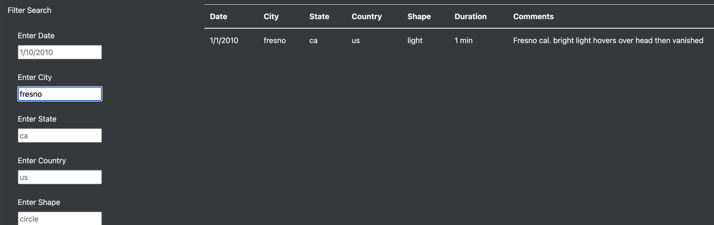

# UFOs

## **Project Overview:**
-----

This projects purpose was to help Dana organize her UFO data, sort and present it through a webpage. Utilizing HTML, Javascript, and CSS, we were able to insert the data, and build multiple filters to help narrow down the data.

## **Resources:**
-----
Data Source: data.js  
Software: Virtual Studio Code

## **Results:**
-----
After building a webpage, we were able to create a filter for each type of data in the row using javascript. To use the filter, you would type the specific keywords into the corresponding search box, then pressing enter.

### City:

### Country:

### Date:

### Shape:

### State:

### Combine all filters:

##  **Summery:**
-----

The webpage was finished for Dana, and works as intended but can be improved on. 
* The data is stored locally, making updating the data not as efficient. To improve on it, the data can be stored on a server or scraped from another website.
* The search function is text-based, making it hard to narrow down the search if you dont already know the keywords. To fix this, you can create a filter using a list with fixed words and a checkbox. Most modern sites use this method.
